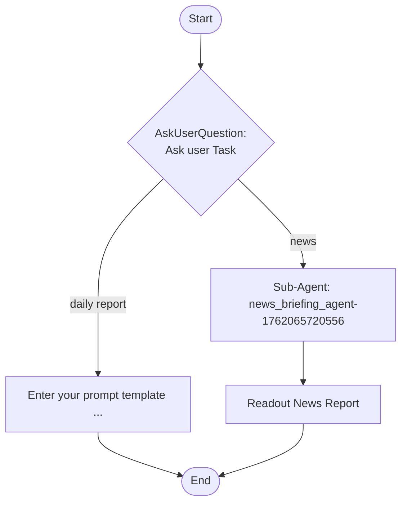

# daily-task-workflow

## Workflow Diagram

## Execution Instructions

Follow the Mermaid flowchart above to execute the workflow step by step.
Start from the "Start" node and follow the arrows to each subsequent node.
For decision nodes (diamonds), evaluate the condition and follow the appropriate branch.
Continue until you reach the "End" node.