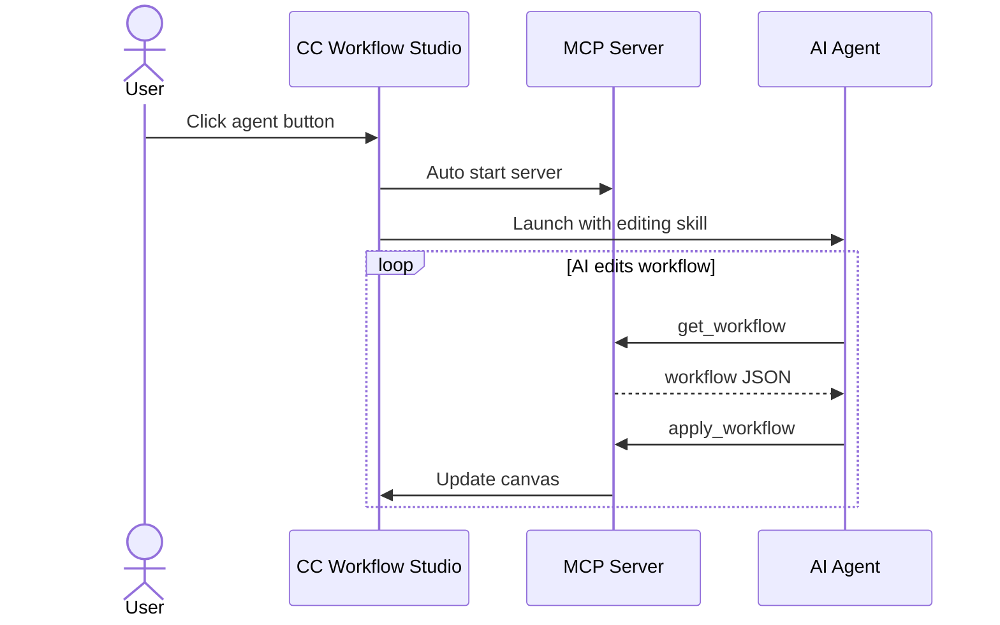
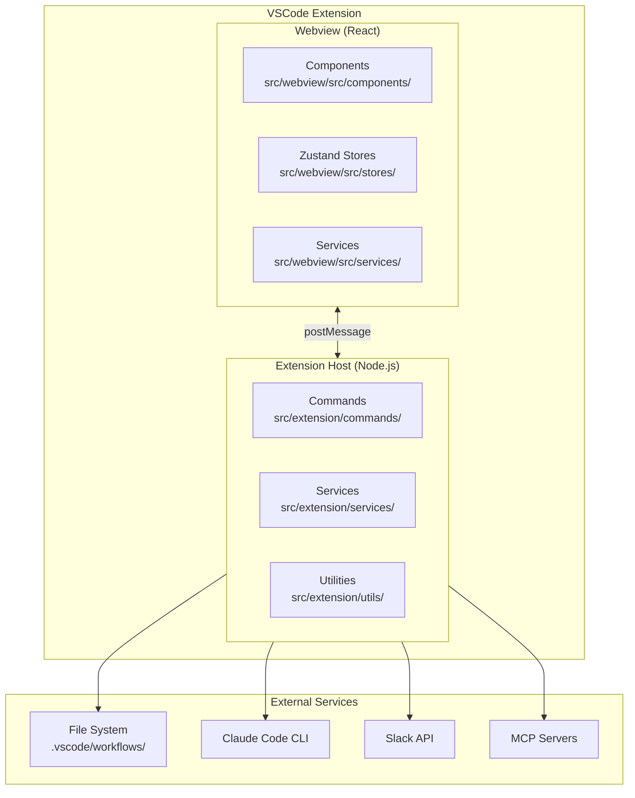
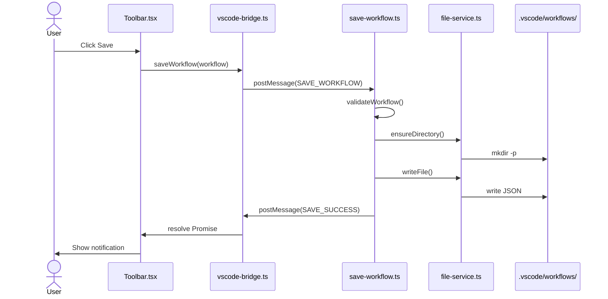
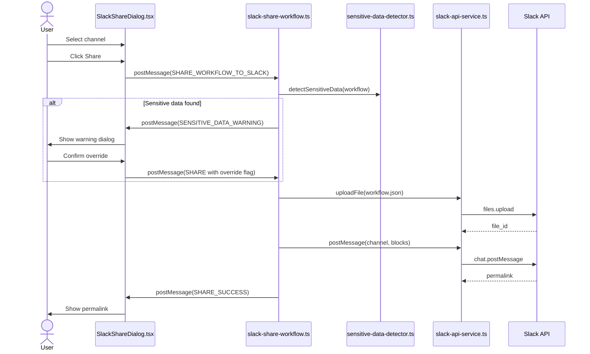
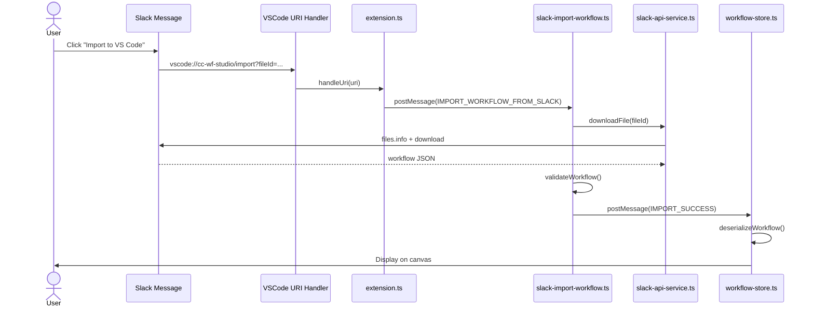
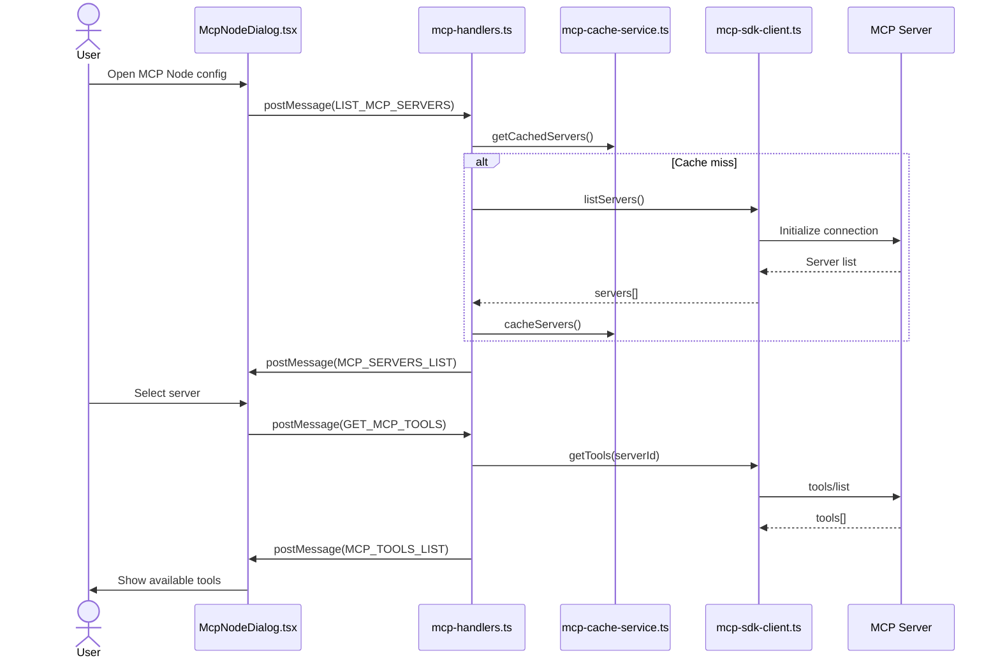

# cc-wf-studio Development Guidelines

Auto-generated from all feature plans. Last updated: 2025-11-01

## Language

- GitHub Issues and Pull Requests (titles, bodies, and comments) MUST be written in English.
- This applies regardless of the conversation language used with Claude.

## Active Technologies
- ローカルファイルシステム (`.vscode/workflows/*.json`, `.claude/skills/*.md`, `.claude/commands/*.md`) (001-cc-wf-studio)
- TypeScript 5.3 (VSCode Extension Host), React 18.2 (Webview UI) (001-node-types-extension)
- ローカルファイルシステム (`.vscode/workflows/*.json`) (001-node-types-extension)
- TypeScript 5.3.0 (001-skill-node)
- File system (SKILL.md files in `~/.claude/skills/` and `.claude/skills/`), workflow JSON files in `.vscode/workflows/` (001-skill-node)
- TypeScript 5.3.0 (VSCode Extension Host), TypeScript/React 18.2 (Webview UI) + VSCode Extension API 1.80.0+, React 18.2, React Flow (visual canvas), Zustand (state management), child_process (Claude Code CLI execution) (001-mcp-node)
- Workflow JSON files in `.vscode/workflows/` directory, Claude Code MCP configuration (user/project/enterprise scopes) (001-mcp-node)
- TypeScript 5.3.0 (VSCode Extension Host), TypeScript/React 18.2 (Webview UI) + VSCode Extension API 1.80.0+, React 18.2, React Flow (visual canvas), Zustand (state management), existing MCP SDK client services (001-mcp-natural-language-mode)
- Workflow JSON files in `.vscode/workflows/` directory (extends existing McpNodeData structure) (001-mcp-natural-language-mode)
- TypeScript 5.3 (VSCode Extension Host), React 18.2 (Webview UI), @slack/web-api 7.x, Node.js http (OAuth callback server), VSCode Secret Storage (001-slack-workflow-sharing)
- Workflow JSON files in `.vscode/workflows/` directory, Slack message attachments (workflow storage), VSCode Secret Storage (OAuth tokens) (001-slack-workflow-sharing)

- TypeScript 5.x (VSCode Extension Host), React 18.x (Webview UI) (001-cc-wf-studio)

## Project Structure

pnpm monorepo. Four packages under `packages/`:

```text
packages/
  core/      # @cc-wf-studio/core  — shared types, validators, Mermaid/Markdown generators, schema (no fs/UI/network)
  mcp/       # @cc-wf-studio/mcp   — MCP server toolkit + ccwf-mcp stdio bin
  cli/       # @cc-wf-studio/cli   — ccwf CLI (render/validate/export/run/preview/canvas/mcp), bundles the webview
  vscode/    # cc-wf-studio        — VSCode extension (canvas, Slack share, in-canvas AI editing)
    src/
    src/webview/   # cc-wf-studio-webview — React webview UI (bundled into the extension + cli)
    resources/     # workflow-schema.{json,toon} synced from core at build time
```

### Schema Files
- **Source of truth**: `packages/core/resources/workflow-schema.json`
- `packages/core/resources/workflow-schema.toon` is auto-generated from the `.json` at build time (`generate:toon`). **Do not edit it manually.**
- `packages/vscode/resources/workflow-schema.{json,toon}` are synced from core during the extension build (`sync:schema`) — do not edit there either.

## Development Workflow & Commands

### Commit Message Guidelines

**IMPORTANT: Keep commit messages simple for squash merge workflow.**

#### Format
```
<type>: <subject>

<optional body with bullet points>
```

#### Example
```
fix: add missing MCP node definition to workflow schema

- Added 'mcp' to supportedNodeTypes
- Added complete MCP node type definition with field constraints
- Fixes MCP_INVALID_PARAMETERS and MCP_INVALID_MODE validation errors
```

#### Rules
- **Subject**: 50 characters max, imperative mood, no period
- **Body**: 3-5 bullet points max, "what" changed only
- **Details**: Put "why" and "how" in PR description, NOT commit message

#### Types
- `feat:` - New feature (minor version bump)
- `fix:` - Bug fix (patch version bump)
- `improvement:` - Minor enhancement to existing feature (patch version bump)
- `docs:` - Documentation only
- `refactor:` - Code refactoring
- `chore:` - Build/tooling changes

#### What to Avoid
❌ Long explanations (Problem/Solution/Impact sections)
❌ Multiple paragraphs
❌ Code blocks
❌ Test results with checkboxes

✅ Simple 3-5 line summary of changes

### Code Quality Checks (Required Before Commit/PR)

**This is a pnpm monorepo — use `pnpm`, not `npm`. Always run these from the repo root after code modifications:**

```bash
pnpm check   # pnpm -r run check across all packages (Biome lint+format on vscode, tsc on others)
pnpm build   # pnpm -r run build across all packages (verify compilation)
```

To target a single package, filter: `pnpm -F @cc-wf-studio/cli run check` / `pnpm -F cc-wf-studio run build`.

### Command Execution Timing

#### During Development
1. **After code modification**:
   ```bash
   pnpm check
   ```
   - Runs lint + format (vscode) and type-checks every package

2. **Before manual E2E testing**:
   ```bash
   pnpm build
   ```
   - Compiles all packages; required for testing the extension / CLI

3. **Before git commit**:
   ```bash
   pnpm check
   ```
   - Ensures all code quality standards are met
   - Prevents committing code with linting/formatting issues

#### Testing
- **Unit/Integration tests**: Not required (manual E2E testing only)
- **Manual E2E testing**: Required for all feature changes and bug fixes
  - Run `pnpm build` first
  - Test in VSCode Extension Development Host

## Version Update & Release Procedure

**IMPORTANT: Versioning is driven by [Changesets](https://github.com/changesets/changesets). A release is cut manually (you open the Release PR) and publishes automatically when that PR merges into `main`. Do NOT hand-edit `version` fields in `package.json`.**

### The four published artifacts

This is a pnpm monorepo with independently versioned packages:

| Package | Published to | Tag format |
|---|---|---|
| `@cc-wf-studio/core` | npm | `@cc-wf-studio/core@x.y.z` |
| `@cc-wf-studio/mcp` | npm | `@cc-wf-studio/mcp@x.y.z` |
| `@cc-wf-studio/cli` | npm | `@cc-wf-studio/cli@x.y.z` |
| `cc-wf-studio` (VSCode extension) | GitHub Release (VSIX attachment) | `cc-wf-studio@x.y.z` |

`cc-wf-studio-webview` is in the Changesets `ignore` list — it is bundled into `@cc-wf-studio/cli` and the extension at build time, never published on its own.

### Per-PR step: add a changeset

When a change should be released, add a changeset describing it:

```bash
pnpm changeset
# interactive: select which package(s) to bump, choose patch/minor/major,
# write a one-line summary (this becomes the CHANGELOG entry)
```

This writes a `.changeset/<slug>.md` file — commit it alongside your code. **You never hand-edit `CHANGELOG.md`; Changesets generates it.** If a PR genuinely needs no release (CI/docs-only tooling), run `pnpm changeset add --empty`.

`updateInternalDependencies: "patch"` is set, so bumping `@cc-wf-studio/core` automatically bumps `cli` / `mcp` (patch) and updates their dependency ranges — no need to author separate changesets for the dependents.

### Release flow (manual Release PR → auto publish on merge)

```
1. feature PR + .changeset/*.md  →  merge to main   (just accumulates; no release)
2. when ready, run "Release — Create Release PR" (Actions, manual dispatch)
   → opens / updates the "Version Packages" PR — a preview of the bumps + CHANGELOG
3. review + merge the "Version Packages" PR into main
   → the merge push triggers "Release — Publish" automatically:
     publishes every pending npm package, creates tags, and if cc-wf-studio
     was bumped, builds + uploads the VSIX to its GitHub Release
4. Repository Owner uploads the VSIX from the GitHub Release to the stores (manual)
```

Confirm = release: because the version bump and publish happen on `main` back-to-back, a version never sits "confirmed but unpublished", so version numbers don't skip. Let changesets accumulate and cut a release only when ready.

- **`.github/workflows/release-version-pr.yml`** — trigger: **`workflow_dispatch`** (manual). Runs `changesets/action` *version step only* — opens / updates the Release PR. No publish. Intentionally manual so "cut a release" is deliberate.
- **`.github/workflows/release.yml`** — trigger: **push to `main`** (+ `workflow_dispatch` fallback). A `check` job skips ordinary feature merges (pending changesets present); on a release push (none pending) the `publish` job runs `changesets/action` *publish step* (`pnpm changeset publish`), then detects the `cc-wf-studio@*` tag and uploads the VSIX.
- `production` is **frozen / legacy** — not part of the flow; do not promote to it. (Past tags/Releases are unaffected — tags are independent of branches.)

### npm authentication: OIDC Trusted Publishing

npm publishes use **OIDC Trusted Publishing** — there is no `NPM_TOKEN` secret. Each of `@cc-wf-studio/{core,mcp,cli}` has a Trusted Publisher configured on npmjs.com pointing at `breaking-brake/cc-wf-studio` → `release.yml`. The trusted publisher is bound to the workflow **file name** (not its trigger), so keep the publish logic in `release.yml`. The publish workflow sets `NPM_CONFIG_PROVENANCE: 'true'`, so each release carries a provenance attestation.

### VS Marketplace / Open VSX publishing (manual, by the Repository Owner)

The publish workflow does **not** push the extension to the Marketplace. It only **builds the `.vsix` and attaches it to the `cc-wf-studio@x.y.z` GitHub Release**. The actual store publish is a manual step performed by the Repository Owner:

1. The "Release — Publish" workflow uploads `packages/vscode/*.vsix` to the GitHub Release for that version.
2. The Repository Owner downloads that `.vsix` from the GitHub Release.
3. The Repository Owner uploads it manually to the VS Marketplace (and Open VSX) via the publisher portal.

So the `.vsix` on the GitHub Release is the source artifact for the store listing — there is no `vsce publish` / `ovsx publish` in CI.

### If you must set a version by hand (rare)

Prefer `pnpm changeset` always. Only edit a `packages/*/package.json` `version` field directly when bootstrapping or fixing a broken state, and expect the next Changesets release to take over from there.

## Code Style

TypeScript 5.x (VSCode Extension Host), React 18.x (Webview UI): Follow standard conventions

## Recent Changes
- 001-mcp-natural-language-mode: Added TypeScript 5.3.0 (VSCode Extension Host), TypeScript/React 18.2 (Webview UI) + VSCode Extension API 1.80.0+, React 18.2, React Flow (visual canvas), Zustand (state management), existing MCP SDK client services
- 001-mcp-node: Added TypeScript 5.3.0 (VSCode Extension Host), TypeScript/React 18.2 (Webview UI) + VSCode Extension API 1.80.0+, React 18.2, React Flow (visual canvas), Zustand (state management), child_process (Claude Code CLI execution)


<!-- MANUAL ADDITIONS START -->

## AI Editing Features

### MCP Server-based AI Editing (Active)
- The built-in MCP server (`cc-workflow-ai-editor` skill) is the primary interface for external AI agents to create and edit workflows.
- All new AI editing development should go through the MCP server approach.



### Chat UI-based AI Editing (Discontinued)
- The chat UI-based AI editing features (Refinement Chat Panel, AI Workflow Generation Dialog) are **no longer under active development**.
- Existing functionality will be maintained but no new features or enhancements will be added.
- Affected features:
  - `001-ai-workflow-generation`: AI Workflow Generation via AiGenerationDialog
  - `001-ai-workflow-refinement`: AI Workflow Refinement via RefinementChatPanel
  - `001-ai-skill-generation`: AI Skill Node Generation via AiGenerationDialog

## Architecture Sequence Diagrams

このセクションでは、cc-wf-studioの主要なデータフローをMermaid形式のシーケンス図で説明します。

### アーキテクチャ概要



### ワークフロー保存フロー



### Slack ワークフロー共有フロー



### Slack ワークフローインポートフロー (Deep Link)



### MCP サーバー/ツール取得フロー



---

## Dialog Component Design Guidelines

### ライブラリ選択

**Radix UI Dialog を使用すること（必須）**

新規ダイアログは必ず `@radix-ui/react-dialog` を使用する。既存のカスタム実装ダイアログは段階的に Radix UI へ移行する。

**理由:**
- アクセシビリティ（ARIA属性、フォーカス管理）が自動的に処理される
- ESCキー、オーバーレイクリックなどの標準動作が統一される
- z-index管理が容易

### z-index 階層設計（4層構造）

```text
レイヤー         z-index   用途
─────────────────────────────────────────────────────
Base            9999      単独ダイアログ、親ダイアログ
Nested          10000     ネストされた子ダイアログ
Confirm         10001     確認ダイアログ
PreviewOverlay  10002     確認ダイアログから開くフルサイズプレビュー
```

| z-index | 用途 | 例 |
|---------|------|-----|
| **9999** | 単独ダイアログ、親ダイアログ | McpNodeDialog, SkillBrowserDialog, SlackShareDialog |
| **10000** | ネストされた子ダイアログ | SkillCreationDialog（SkillBrowserDialog内）, SlackManualTokenDialog |
| **10001** | 確認・警告ダイアログ | ConfirmDialog（削除確認など）, DiffPreviewDialog |
| **10002** | 確認ダイアログから開くフルサイズプレビュー | DiffPreviewDialog の Overview プレビュー |

### 実装パターン

#### 基本構造（Radix UI Dialog）

```tsx
import * as Dialog from '@radix-ui/react-dialog';

// z-index定数（推奨: 共通定数ファイルで管理）
const Z_INDEX = {
  DIALOG_BASE: 9999,
  DIALOG_NESTED: 10000,
  DIALOG_CONFIRM: 10001,
  DIALOG_PREVIEW_OVERLAY: 10002,
} as const;

export function MyDialog({ isOpen, onClose }: Props) {
  return (
    <Dialog.Root open={isOpen} onOpenChange={(open) => !open && onClose()}>
      <Dialog.Portal>
        <Dialog.Overlay
          style={{
            position: 'fixed',
            inset: 0,
            backgroundColor: 'rgba(0, 0, 0, 0.5)',
            display: 'flex',
            alignItems: 'center',
            justifyContent: 'center',
            zIndex: Z_INDEX.DIALOG_BASE, // ← 必ず設定
          }}
        >
          <Dialog.Content>
            {/* コンテンツ */}
          </Dialog.Content>
        </Dialog.Overlay>
      </Dialog.Portal>
    </Dialog.Root>
  );
}
```

#### ネストダイアログのパターン

親ダイアログ内で子ダイアログを開く場合:

```tsx
// 親ダイアログ: z-index 9999
<SkillBrowserDialog>
  {/* 子ダイアログ: z-index 10000 */}
  <SkillCreationDialog />
</SkillBrowserDialog>
```

### チェックリスト（新規ダイアログ作成時）

- [ ] `@radix-ui/react-dialog` を使用している
- [ ] `Dialog.Overlay` に `zIndex` を設定している
- [ ] z-index値が階層設計に従っている
  - 単独/親ダイアログ → 9999
  - ネストされる子ダイアログ → 10000
  - 確認ダイアログ → 10001
  - 確認ダイアログから開くフルサイズプレビュー → 10002
- [ ] ESCキーでの閉じる動作が正しく機能する
- [ ] オーバーレイクリックでの閉じる動作が正しく機能する

### 現在のダイアログ一覧と状態

全てのダイアログが Radix UI Dialog を使用し、z-index階層設計に準拠しています。

| ダイアログ | z-index | 役割 | 状態 |
|-----------|---------|------|------|
| ConfirmDialog | 10001 | 確認ダイアログ | ✅ |
| DiffPreviewDialog | 10001 | 確認ダイアログ（AI編集） | ✅ |
| DiffPreviewDialog の Overview プレビュー | 10002 | 確認ダイアログから開くフルサイズプレビュー | ✅ |
| SkillCreationDialog | 10000 | 子ダイアログ | ✅ |
| SlackManualTokenDialog | 10000 | 子ダイアログ | ✅ |
| SkillBrowserDialog | 9999 | 親ダイアログ | ✅ |
| McpNodeDialog | 9999 | 単独 | ✅ |
| SubAgentFlowDialog | 9999 | 親ダイアログ | ✅ |
| SlackShareDialog | 9999 | 親ダイアログ | ✅ |
| SlackConnectionRequiredDialog | 9999 | 単独 | ✅ |
| McpNodeEditDialog | 9999 | 単独 | ✅ |

## External Link Implementation Pattern

Webview から外部URLを開く場合、VSCode の制約上 `<a href>` は使えないため、`openExternalUrl` ユーティリティと `lucide-react` の `ExternalLink` アイコンを使用する。

### 実装方法

```tsx
import { ExternalLink } from 'lucide-react';
import { openExternalUrl } from '../../services/vscode-bridge';

// アイコンリンク（テキストなし）
<span
  role="button"
  tabIndex={0}
  onClick={() => openExternalUrl('https://example.com')}
  onKeyDown={(e) => {
    if (e.key === 'Enter' || e.key === ' ') {
      openExternalUrl('https://example.com');
    }
  }}
  style={{
    display: 'inline-flex',
    cursor: 'pointer',
    color: 'var(--vscode-textLink-foreground)',
  }}
  title="Open documentation"
>
  <ExternalLink size={11} />
</span>
```

### 要点
- `openExternalUrl()` は Extension Host 経由で `vscode.env.openExternal` を呼ぶ
- `role="button"` + `tabIndex={0}` + `onKeyDown` でアクセシビリティ対応
- アイコンサイズは周囲のテキストサイズに合わせる（11〜14px）
- `e.stopPropagation()` はアコーディオンヘッダー内など親要素のクリックイベントと競合する場合に追加する
- 既存の使用例: `McpServerSection.tsx`, `CodexNodeDialog.tsx`, `ClaudeApiUploadDialog.tsx`

<!-- MANUAL ADDITIONS END -->
