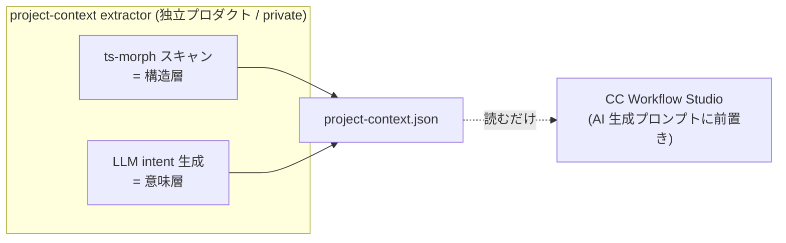

# project-context PoC — 設計ドキュメント

> ステータス: 設計提案（PoC 着手前）
> 対象ブランチ: `claude/project-context-poc-schema-m32Bp`
> 検証対象プロジェクト: この `cc-wf-studio` モノレポ自身
>
> このドキュメントは、CC Workflow Studio とは独立した新プロダクト（仮称
> **project-context extractor**）の PoC 設計をまとめたもの。レポ本体のワークフロー
> JSON スキーマ／コードを実際に読んだ上で、それに整合した `project-context.json`
> スキーマを定義し、検証計画までを示す。

関連ファイル:
- スキーマ定義: [`project-context.schema.json`](./project-context.schema.json)
- 出力例（この repo を対象にした手書きサンプル）: [`examples/cc-wf-studio.project-context.json`](./examples/cc-wf-studio.project-context.json)

---

## 1. 目的と仮説

### 1.1 解きたい問題

CC Workflow Studio のワークフロー生成は、ローカルのユーザーの AI コーディング
エージェント（Claude Code 等）が実行する。「正しい JSON を生成できるか」は問題で
はない（スキーマを渡せば生成できる）。問題は次の 2 点：

1. **意図の汲み取りがプロンプト依存** — エージェントが毎回ゼロからソースを探索し、
   設計意図をプロンプト次第で再発見している。
2. **探索コストが毎回かかる** — 同じプロジェクトでも生成のたびに grep / glob /
   ファイル読み込みが走り、遅い・トークンを食う。

### 1.2 借りる設計思想

OSS *Understand Anything* (Lum1104/Understand-Anything, MIT) の
**「構造↔意味の分離」という思想だけ**を借りる（コード依存は持ち込まない）。

| 層 | 取得方法 | 解く問題 | 内容 |
|---|---|---|---|
| **構造層** | 決定論的（ts-morph） | 探索コストの削減 | 「どこに何があるか」= path / export / kind |
| **意味層** | LLM 生成 | 意図のプロンプト非依存化 | 「このファイルは何のためにあるか」= 1 行 intent |

### 1.3 検証する仮説

> 対象プロジェクトの構造＋意図を一度抽出して永続化しておけば、ワークフロー生成時に
> エージェントの探索ステップが減り、(a) 生成が速くなる、(b) プロンプトに依存せず
> 意図を渡せる。

**測る指標（「出力の具体性」ではない点に注意）:**

- 探索ステップ数（Read / Grep / Glob の呼び出し回数）
- トークン消費（input / output）
- 生成時間（wall-clock）
- プロンプトの軽さ（「このプロジェクトは〜」という説明を生成プロンプトから削れるか）

効果が出なければ「グラフ化（や事前構造化）は時期尚早」という結論も**正当な成果**
として受け入れる（§6 リスク4）。

---

## 2. レポ調査で確定した「寄せるべき設計哲学」

`packages/core/resources/workflow-schema.json` と代表サンプル
（`.vscode/workflows/automated-pr-code-review-flow.json`）、および
`packages/core/src/types/workflow-definition.ts` を読んで確認した、ワークフロー
JSON の設計哲学。`project-context.json` はこれに整合させる。

1. **構造と意味がすでに分離されている。**
   ワークフロー JSON 自体が、決定論的な「配線」と自然言語の「意図」を分けている：
   - 配線（構造）: `id` / `type` / ポート / `connections`（`from`/`to`/`fromPort`/`toPort`）
   - 意図（意味）: `description` / `prompt` / `evaluationTarget` / `condition` /
     `aiParameterConfig.description` / `toolDescription`

   → これは PoC が借りたい「構造↔意味の分離」とまさに同型。`project-context.json`
   でも `path`/`exports`/`kind`（構造）と `intent`/`summary`（意味）を明確に分ける。

2. **スキーマは「AI への指示」であって「ランタイム制約」ではない。**
   `workflow-schema-tuning` スキルが明記する設計思想 —「align direction, do not
   prescribe rules」。スキーマの `description` / `aiGenerationGuidance` / `examples`
   は、バリデータが弾くためではなく**エージェントの生成方向を寄せるため**にある。

   → `project-context.json` も同じ立ち位置にする：**エージェントへの advisory な
   コンテキスト**であって、何かを強制する契約ではない。これが §6 リスク3
   （エージェントが JSON を信用するか）に直結する。

3. **トップレベルに `metadata` ブロック + `schemaVersion`。**
   workflow-schema.json は `schemaVersion` と `metadata{description, ...}` を持つ。
   ワークフローファイルは `createdAt`/`updatedAt`（ISO8601）と `version`(semver) を持つ。
   → `project-context.json` も `schemaVersion` + `metadata`（description, project,
   generatedAt, generator）を持たせる。

4. **エンティティは安定 id + 種別ディスクリミネータ + 自然言語フィールドの配列。**
   nodes は `{id, type, name, position, data}`。
   → files は `{id, path, kind, exports, intent}`。`type`↔`kind`、自然言語の
   `description`↔`intent` が対応。

5. **AI 消費はトークン最適化を意識している。**
   スキーマは TOON 形式に変換して `get_workflow_schema` で渡している（token-optimized）。
   → トークン削減は本プロダクトの主指標（§1.3）と一致。`project-context.json` も
   将来 TOON 化を検討できる形（フラットな配列）にしておく。

### 2.1 対応表（ワークフロー JSON → project-context.json）

| workflow JSON | project-context.json | 備考 |
|---|---|---|
| `schemaVersion` | `schemaVersion` | semver |
| `metadata` / top-level `description` | `metadata.description` | |
| `nodes[]` | `files[]` | 「エンティティの配列」 |
| node `id` | file `id`（`f-001`…） | 安定 id |
| node `type` | file `kind` | 種別ディスクリミネータ（heuristic） |
| node `data.description`/`prompt` | file `intent` | **意味層** |
| `connections[]`（配線） | **（PoC では持たない）** | 呼び出し関係グラフ＝スコープ外（§5） |
| `createdAt`/`updatedAt` | `metadata.generatedAt` | |

> **重要な非対称性:** ワークフロー = nodes **+** connections。
> project-context PoC = files のみ（= nodes だけ、edges なし）。
> これは意図的。呼び出し関係グラフ（connections の類似物）は効くのが後段なので
> PoC では捨てる（§5）。PoC は「ノードの目録」であって「グラフ」ではない。

---

## 3. `project-context.json` スキーマ

完全な定義は [`project-context.schema.json`](./project-context.schema.json)（JSON
Schema draft-07）。要点のみ抜粋：

```jsonc
{
  "schemaVersion": "0.1.0",
  "metadata": {
    "description": "...",
    "project": {
      "name": "cc-wf-studio",
      "root": ".",
      "languages": ["typescript"],
      "summary": "<LLM: プロジェクトは何か・どう構成されているか 1-3行>"   // 意味層（プロジェクト級）
    },
    "generatedAt": "2026-06-06T00:00:00Z",
    "generator": { "name": "project-context-extractor", "version": "0.1.0" }
  },
  "files": [
    {
      "id": "f-002",                                              // 安定 id
      "path": "packages/core/src/services/workflow-prompt-generator.ts", // 構造層（決定論的）
      "kind": "service",                                          // 構造層（heuristic）
      "exports": ["generateMermaidFlowchart", "sanitizeNodeId"], // 構造層（ts-morph）
      "intent": "ワークフローを Mermaid + 実行指示の AI 用成果物に変換する。",  // 意味層（LLM 1行）
      "intentStatus": "fresh"                                     // 鮮度（advisory）
    }
  ]
}
```

### 3.1 フィールドの設計判断

- **`intent` は optional。** 「構造のみ」生成（実験 Pattern A, §7.2）では意図層を
  省いて構造だけ吐けるようにする。これが PoC の隠れた変数（リスク3）を測るため
  に必要。
- **`kind` は heuristic & advisory。** path/ファイル名/拡張子からのベストエフォート。
  間違っても PoC では許容（ランタイム制約ではない=哲学2）。enum:
  `component | hook | store | service | command | api | type | util | schema | entry | test | config | other`。
- **`exports` は決定論的インデックス。** 「X はどこで定義されているか」を事前に持つ
  ことが探索削減の本体。これがあれば agent は `grep "export.*X"` を省ける（はず）。
- **`intentStatus`** = `fresh | stale | missing`。鮮度の自己申告。`stale` は将来の
  staleness 可視化（構造ハッシュ変化の警告）用のフック。PoC では基本 `fresh`、
  意図を省いたら `missing`。
- **`metadata.structureFingerprint`（optional / future）。** 構造層全体の単一ハッシュ。
  **staleness の警告シグナル専用**で、差分更新には使わない（§5）。

### 3.2 kind ヒューリスティック（TS モノレポ向け初期ルール）

優先順に評価し、最初にマッチした kind を採用：

| 条件 | kind |
|---|---|
| `*.test.ts(x)` / `*.spec.ts(x)` / `__tests__/` 配下 | `test` |
| `*.config.*` / `tsconfig*.json` / `package.json` / `biome.json` | `config` |
| `resources/*.json` / `*.schema.json` | `schema` |
| `index.ts` / `cli.ts` / `extension.ts`（パッケージ/拡張のエントリ） | `entry` |
| `**/components/**/*.tsx` | `component` |
| ファイル名が `use[A-Z]*` | `hook` |
| `**/stores/**` / `*-store.ts` | `store` |
| `**/services/**` / `*-service.ts` | `service` |
| `**/commands/**` | `command` |
| `**/types/**` / `*.d.ts` | `type` |
| `**/utils/**` / `*-util*.ts` | `util` |
| それ以外 | `other` |

> ルールは `kind` の enum に追従して拡張可能。PoC ではこの程度の粒度で十分。

---

## 4. 接続方式（疎結合）

確定事項どおり、**ファイル受け渡し**で疎結合にする。



- 契約は **JSON スキーマ 1 枚**（[`project-context.schema.json`](./project-context.schema.json)）。
- CC WF Studio 側は「読むだけ」。ライブラリ統合はしない（AGPL 伝播回避）。
- **配置パス（PoC 既定）:** リポジトリルートの `project-context.json`。
  CC WF Studio の MCP スキル冒頭で、存在すれば読んで生成プロンプトに前置きする
  （実験用。本体への恒久統合はしない）。
- **将来 1 行メモ（MCP 化）:** `get_workflow_schema` / `get_current_workflow` と
  同列に `get_project_context` MCP ツールを足せば、ファイル経由なしで agent-neutral
  に渡せる。三面ナラティブ（agent-neutral / ファイル契約 / 構造↔意味）と一貫。
  PoC ではやらない。

---

## 5. スコープ

### 入れる
- TS/JS プロジェクト 1 種に限定（ts-morph で十分。Tree-sitter は不要）。
- 抽出は「path・export 名・大まかな kind（heuristic）」。
- 各ファイルの 1 行 intent（LLM）＋ プロジェクト級 summary（LLM）。
- 最小の永続化：1 回スキャンして `project-context.json` に全保存。
- 生成時、agent にこの JSON を先に渡す。
- 小プロジェクト前提で全件渡す（サブグラフ検索なし）。

### 外す（重要）
- **呼び出し関係グラフ**（= workflow の connections 相当）。効くのは後段。PoC では捨てる。
- **fingerprint 差分更新。** 構造・意味とも**手動トリガーで全再生成**
  （「構造は高頻度には変わらない」前提）。
- 可視化・ダッシュボード・ガイドツアー（Understand Anything の主役だが、本プロダクト
  の目的は「AI が消費する構造化データ」なので不要）。
- マルチ言語。
- サブグラフ検索層。

---

## 6. 既知のリスク・論点

1. **意味層の静かな陳腐化。** path・export が変わらなくても、ファイルの責務だけ
   変わると `intent` が古くなる。手動トリガーの弱点は「いつ引くべきか分からない」こと。
   - PoC 方針: 「中身の役割が変わったら再生成」と運用注意を明記。
   - 将来: `structureFingerprint` 変化を **警告のみ** で出す（差分更新まではしない）。

2. **再生成の粒度と運用崩壊。** 大規模で全再生成が重いと「面倒で引かない→ stale 化」。
   - PoC: スコープ外。
   - 将来 1 行メモ: 「ファイル単位/ディレクトリ単位の部分再生成」。

3. **エージェントが JSON を信用して探索を省くか不確実。** Claude Code は要約があっても
   自分で確認しに行くことがある。「探索を省く」をどう担保するかが PoC の隠れた変数。
   - 対策: 複数パターンを試す設計にする（§7.2 の Pattern A/B/C）。

4. **グラフ化が時期尚早の可能性。** 資産が少なく高品質なうちは few-shot で足りる場合が
   ある。効果が出なければ「グラフ化（事前構造化）は時期尚早」という結論も正当な成果。

---

## 7. 検証の最小実装計画

### 7.1 構造抽出 → JSON 出力（独立プロダクト側）

最小スクリプト 1 本（独立 private repo 想定。PoC 中は本 repo の
`tools/` などで試作してもよい）。

1. **入力:** プロジェクトルート。`tsconfig.json` を ts-morph の `Project` に読ませる。
2. **構造層（決定論的, ts-morph）:**
   - `project.getSourceFiles()` で対象 `.ts/.tsx` を列挙
     （`node_modules` / `dist` / `*.d.ts` 生成物は除外）。
   - 各ファイルで `sourceFile.getExportedDeclarations()` の key を `exports[]` に。
   - path/ファイル名/拡張子から `kind` を heuristic 判定（§3.2）。
   - 安定 `id` は path のソート順で連番（`f-001`…）＝再生成で同 path に同 id。
3. **意味層（LLM）:**
   - 各ファイルにつき「path + exports（+ 任意で先頭 N 行 / 既存 JSDoc）」を渡し、
     1 行 intent を生成。
   - プロジェクト summary はファイル一覧（path + kind）をまとめて 1 回生成。
   - **Claude を使用**（最新かつ最も capable なモデルを既定に）。
4. **出力:** スキーマ準拠の `project-context.json` を書き出す。
5. **コスト目安:** この repo の `packages/**/src/**/*.ts` で数十〜百数十ファイル規模。
   構造抽出は秒オーダー。intent 生成は 1 ファイル 1 リクエスト（or バッチ）で、
   PoC では総額・総時間を 1 回計測しておく（「全再生成の重さ」§6-2 の実測値）。

### 7.2 あり/なし比較（測定）

同一のワークフロー生成タスクを、4 条件 × 各 N 回（例 N=5）流して比較する。

| 条件 | agent に渡すもの | 狙い |
|---|---|---|
| **Baseline** | 何もなし（従来どおり探索させる） | 現状値 |
| **Pattern A: 構造のみ** | `files[].path/kind/exports`（intent なし） | 構造だけで探索が減るか |
| **Pattern B: 構造+意味＋信頼指示** | フル JSON ＋「この context を信頼し再探索を最小化せよ」 | 上限効果 |
| **Pattern C: 構造+意味（信頼指示なし）** | フル JSON のみ | agent の自律判断での効果 |

**手順:**
1. 生成タスクを固定（例:「PR レビュー自動化ワークフローを作って」）。プロンプトは
   全条件で同一。ただし B のみ信頼指示を 1 文追加。
2. Claude Code をヘッドレスで実行：`claude -p "<task>" --output-format json`
   （`usage` から input/output トークン、所要時間を取得）。
3. **探索ステップ数**は `PreToolUse` フックで `Read|Grep|Glob` の呼び出しを
   カウント（フックがタスク開始からの回数をログに追記）。
4. 生成物の妥当性は `apply_workflow` 相当の `validateAIGeneratedWorkflow`
   （`packages/core`）に通して valid/invalid を記録（最低品質ゲート。主指標ではない）。
5. 各条件 N 回の中央値で比較。

**記録テーブル（条件ごと）:**

| metric | Baseline | A | B | C |
|---|---|---|---|---|
| 探索ツール呼び出し数（Read/Grep/Glob 合計） | | | | |
| input トークン | | | | |
| output トークン | | | | |
| 生成時間（s） | | | | |
| valid 率 | | | | |

**プロンプトの軽さ（指標2）の測り方:**
生成プロンプトから「このプロジェクトは〜」という説明文を削っても（= summary に
肩代わりさせても）valid 率・探索数が悪化しないかを、Pattern B/C で「説明あり/なし」
の 2 版で比較。削れれば仮説 (b) を支持。

### 7.3 判定

- 仮説 (a) 支持 = A or C で探索数・トークン・時間が Baseline より有意に減る。
- 仮説 (b) 支持 = summary で説明文を肩代わりしても劣化しない。
- B と C の差 = 「JSON を信頼させる指示」の効き（リスク3 の答え）。
- どれも効かなければ §6-4 の結論（時期尚早）を採用。

---

## 8. PoC でやらないことの再確認（将来 1 行メモ）

- MCP 化（`get_project_context` ツール）— agent-neutral 化の本命だが PoC 外。
- 呼び出し関係グラフ（connections 相当）の追加。
- `structureFingerprint` による staleness **警告**（差分更新は永続的にやらない）。
- 部分再生成（ファイル/ディレクトリ単位）。
- マルチ言語 / サブグラフ検索。
