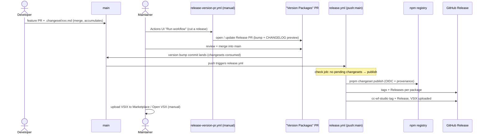
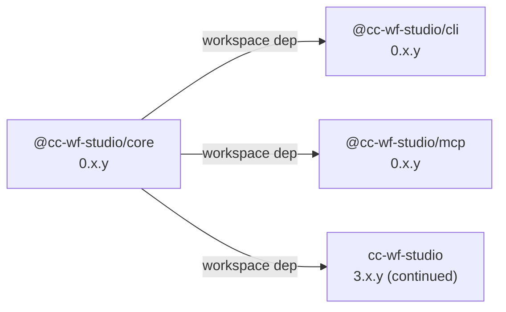

# Release Flow

This repository uses **[Changesets](https://github.com/changesets/changesets)** for versioning across the pnpm workspace. A release is **cut manually** (you open the Release PR when ready) and **published automatically** when that PR merges into `main`. There is no `production` branch in the flow anymore and no manual publish dispatch.

## TL;DR for contributors

1. Open a feature/fix PR against `main`.
2. If your change affects a published package, run `pnpm changeset` locally and commit the generated `.changeset/<name>.md`. (Docs/chore-only PRs: `pnpm changeset add --empty`.)
3. Check the **changeset-bot** comment on your PR — 🦋 means a changeset was detected, ⚠️ means none was found. Add one if the PR should release something; add an empty one if it intentionally shouldn't.
4. Merge your PR. **Nothing is released yet** — changesets just accumulate on `main`.
5. When you decide to release, a maintainer runs the **"Release — Create Release PR"** workflow from the Actions UI. It opens a `chore(release): version packages` PR previewing the version bumps + CHANGELOG diff.
6. Review and **merge that Release PR into `main`**. The merge triggers **"Release — Publish"** automatically: it publishes the npm packages, creates the tags, and uploads the VSIX for `cc-wf-studio`.
7. The Repository Owner uploads the VSIX from the GitHub Release to the VS Marketplace / Open VSX (manual — see below).

> [!IMPORTANT]
> **Releasing is a human-only action.** AI agents must NOT self-trigger any release step — do not run the "Release — Create Release PR" workflow, do not merge the Release PR into `main`, and do not dispatch publish workflows. Merging the Release PR is an irreversible publish (npm cannot be re-published). Agents may *prepare* changes and *explain* this procedure, but a human performs the actual release actions.

## Design: confirm = release

The Release PR is created **manually** (deliberate "cut a release" action) and merging it **auto-publishes**. Because the version-bump commit and the publish happen on the same branch back-to-back, a version can never sit "confirmed but unpublished" — so npm version numbers never skip. To avoid frequent/jumpy versions, simply let changesets accumulate on `main` and cut a release only when ready; multiple pending changesets collapse into a single bump (highest level wins).

## Branch model

- `main` — the one and only release branch. Feature work branches off `main` and merges back via PR. The Release PR also lands here, and publishing happens from `main`.
- `production` — **frozen / legacy.** It is no longer part of the release flow; do not promote to it. It is kept only so historical commits/tags remain easy to reference. (Git tags are independent of branches and are unaffected regardless.)

## Two workflows

| Workflow | Trigger | Does |
|---|---|---|
| `.github/workflows/release-version-pr.yml` | **`workflow_dispatch`** (manual) | Runs `changesets/action` **version step** — opens / updates the "Version Packages" (Release) PR. No publish. |
| `.github/workflows/release.yml` | **push to `main`** (+ `workflow_dispatch` fallback) | A `check` job skips ordinary feature merges (pending changesets present). On a release push (no pending changesets) the `publish` job runs `changesets/action` **publish step** (`pnpm changeset publish`) over npm OIDC, then detects the `cc-wf-studio@*` tag and uploads the VSIX. |

The `release.yml` `check` job is what makes "publish on every push to main" safe: ordinary feature merges still carry `.changeset/*.md`, so `should_publish` is `false` and the publish job is skipped. Only the Release PR merge (changesets consumed, versions bumped) publishes. `pnpm changeset publish` is also idempotent — it only publishes versions ahead of the registry — so any stray no-op push is harmless.

## What each package looks like at release

| Package | npm | Tag | VSIX attached |
|---|---|---|---|
| `@cc-wf-studio/core` | ✅ public | `@cc-wf-studio/core@x.y.z` | — |
| `@cc-wf-studio/cli` | ✅ public | `@cc-wf-studio/cli@x.y.z` | — |
| `@cc-wf-studio/mcp` | ✅ public | `@cc-wf-studio/mcp@x.y.z` | — |
| `cc-wf-studio` (VSCode extension) | ❌ private | `cc-wf-studio@x.y.z` | ✅ `cc-wf-studio-x.y.z.vsix` |

`cc-wf-studio` is `"private": true`, so Changesets versions and tags it but does not push it to npm. The workflow detects the tag, builds the VSIX, and attaches it to the GitHub Release.

`cc-wf-studio-webview` is in the Changesets `ignore` list — it is bundled into `@cc-wf-studio/cli` and the extension at build time, never published on its own.

## End-to-end flow



## npm authentication: OIDC Trusted Publishing

npm publishes use **OIDC Trusted Publishing** — there is **no `NPM_TOKEN` secret**. Each of `@cc-wf-studio/{core,mcp,cli}` has a Trusted Publisher configured on npmjs.com pointing at `breaking-brake/cc-wf-studio` → **`release.yml`**. The trusted publisher is bound to the workflow **file name**, not its trigger, so switching `release.yml` from dispatch to push did not require any npm-side reconfiguration. The publish workflow sets `NPM_CONFIG_PROVENANCE: 'true'`, so each release carries a provenance attestation visible on npmjs.com.

## VS Marketplace / Open VSX (manual)

The workflow does **not** push the extension to the Marketplace. It only builds the `.vsix` and attaches it to the `cc-wf-studio@x.y.z` GitHub Release. The store publish is manual:

1. "Release — Publish" uploads `packages/vscode/*.vsix` to the GitHub Release.
2. The Repository Owner downloads that `.vsix`.
3. The Repository Owner uploads it to the VS Marketplace (and Open VSX) via the publisher portal.

So the GitHub Release `.vsix` is the source artifact for the store listing — there is no `vsce publish` / `ovsx publish` in CI.

## Independent versions + internal dependency propagation

Each workspace package is versioned independently — there is no `fixed` or `linked` group in `.changeset/config.json`.



- `cc-wf-studio` keeps its existing 3.34.x stream so the Marketplace listing stays continuous.
- New packages start at pre-1.0 (`core@0.1.x`, `mcp@0.1.x`, `cli@0.1.x`).
- `updateInternalDependencies: "patch"` is set, so bumping `@cc-wf-studio/core` automatically bumps `cli` / `mcp` (patch) and updates their dependency ranges — no separate changeset needed for the dependents.
- `workspace:*` dependencies are replaced with the actual published versions when `changeset publish` runs.

## Required secrets

| Secret | Purpose |
|---|---|
| `RELEASE_BOT_APP_ID` | GitHub App ID used to author release commits / PRs as a bot. |
| `RELEASE_BOT_PRIVATE_KEY` | Private key for the above GitHub App. |

No `NPM_TOKEN` — npm publishing is via OIDC Trusted Publishing.

## Authoring a changeset

```bash
pnpm changeset
```

The interactive prompt asks: which packages changed, the bump level (`patch` / `minor` / `major`), and a summary used for the CHANGELOG entry. Commit the generated file alongside your code. You never hand-edit `CHANGELOG.md` — Changesets generates it.

### Changeset bot

The [changeset-bot](https://github.com/apps/changeset-bot) GitHub App is installed on this repository. It comments on every PR to show whether a changeset is present:

- **🦋 Changeset detected** — the PR adds a `.changeset/*.md` file (a real bump or an empty one).
- **⚠️ No Changeset found** — the PR adds none. This is a *reminder, not a blocker*. If the PR genuinely needs no release, add an empty changeset (`pnpm changeset add --empty`) to make the intent explicit and clear the warning.

There is no hard CI gate that fails the build on a missing changeset; the bot comment plus the human review at the Release PR are the safety net.

## What doesn't trigger a release

- Pushes to branches other than `main`.
- An ordinary feature merge to `main` — it carries pending changesets, so `release.yml`'s `check` job skips publishing.
- Merging the Release PR **does** publish (this is the deliberate release trigger).
- A push to `main` with no version bump (e.g. a docs PR with no changeset) — `changeset publish` finds nothing ahead of the registry and no-ops.

## Prior release flows (for reference)

- **Original**: `semantic-release` on push to `production` (commit-message driven), with auto-sync `production` → `main`.
- **Then**: Changesets with a manual publish **dispatch** from a `production` branch (Version PR auto-opened on push to main; `guard-production.yml` blocked premature promotes).
- **Current**: Changesets with a **manually-created Release PR** whose **merge into `main` auto-publishes** (OIDC). `production` is frozen; `guard-production.yml` was removed. This couples confirm = release so version numbers don't skip.
